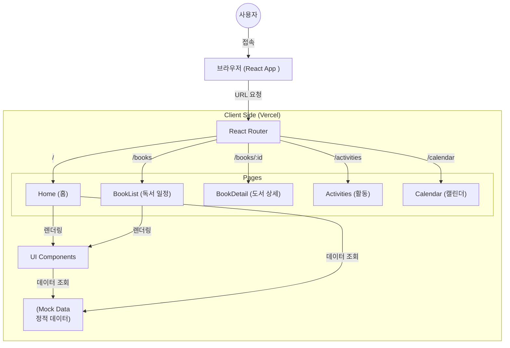

# 아이온 책모임 코드베이스 분석

## 1. 프로젝트 개요
- **유형**: 단일 페이지 애플리케이션 (SPA)
- **프레임워크**: React 19 + Vite
- **배포**: Vercel (컨텍스트 기반 추론)
- **목적**: 독서 모임 "아이온 책모임"을 위한 모바일 우선 웹 애플리케이션 (독서 일정, 도서 목록, 커뮤니티 활동 관리).

## 2. 기술 스택
| 구분 | 기술 | 버전 | 비고 |
|------|------|------|------|
| **Core** | React | ^19.2.0 | 최신 React 버전 |
| **Bundler** | Vite | ^7.2.4 | 빠른 빌드 도구 |
| **Routing** | React Router | ^7.11.0 | 클라이언트 사이드 라우팅 |
| **Styling** | CSS Modules | N/A | `*.module.css` 패턴 사용 |
| **Icons** | Lucide React | ^0.562.0 | 일관된 아이콘 세트 |
| **Date Utils**| date-fns | ^4.1.0 | 날짜 처리 라이브러리 |

## 3. 아키텍처 및 데이터 흐름



## 4. 폴더 구조
표준적인 React 프로젝트 구조를 따르고 있습니다:

```
src/
├── components/        # 재사용 가능한 UI 컴포넌트
│   ├── common/        # 버튼, 입력창 등 공통 요소
│   ├── features/      # 비즈니스 로직 컴포넌트 (예: BookCard)
│   └── layout/        # 앱 레이아웃 (헤더, 하단 탭바)
├── data/              # 정적 데이터 소스
│   └── mockData.js    # 2026년 도서 목록 및 공지사항 데이터
├── pages/             # 라우트 페이지 컴포넌트
└── styles/            # 전역 스타일 및 변수
```

## 5. 주요 기능 분석

### A. 데이터 관리
- **정적 Mock Data 사용**: `mockData.js` 파일에 2026년 12개월치 도서 일정, 공지사항, 활동 내역이 하드코딩되어 있습니다.
- **특징**: 별도의 백엔드 서버 통신 없이 즉시 렌더링되므로 속도가 매우 빠르지만, 데이터 변경 시 배포가 필요합니다.

### B. 네비게이션 및 레이아웃
- **모바일 퍼스트**: 하단 탭바(`BottomTabBar`)를 통해 주요 메뉴(홈, 책, 활동, 캘린더)로 쉽게 이동할 수 있습니다.
- **전역 헤더**: `AppHeader`를 통해 브랜드 아이덴티티를 유지합니다.
- **라우팅**: `Layout` 컴포넌트 내에 `Outlet`을 사용하여 페이지 전환 시에도 레이아웃이 유지됩니다.

### C. 핵심 페이지
1.  **홈 (`Home.jsx`)**: 이번 달 도서, 공지사항 요약, 최신 활동 피드를 한눈에 보여주는 대시보드입니다.
2.  **독서 일정 (`BookList.jsx`)**: 2026년 전체 도서 라인업을 월별 타임라인 형태로 제공합니다.
3.  **활동 (`Activities.jsx`)**: 커뮤니티의 공지사항과 멤버들의 활동 내역을 리스트 형태로 보여줍니다.

## 6. 종합 의견
- **최신 기술 적용**: React 19와 Vite를 사용하여 성능과 개발 생산성이 높습니다.
- **확장 용이성**: 데이터 접근 로직이 단순하게 분리되어 있어, 향후 Supabase나 Firebase 같은 실제 백엔드를 연동하기 쉬운 구조입니다.
- **UX 고려**: 모바일 환경을 고려한 하단 네비게이션 바 처리가 잘 되어 있습니다.
