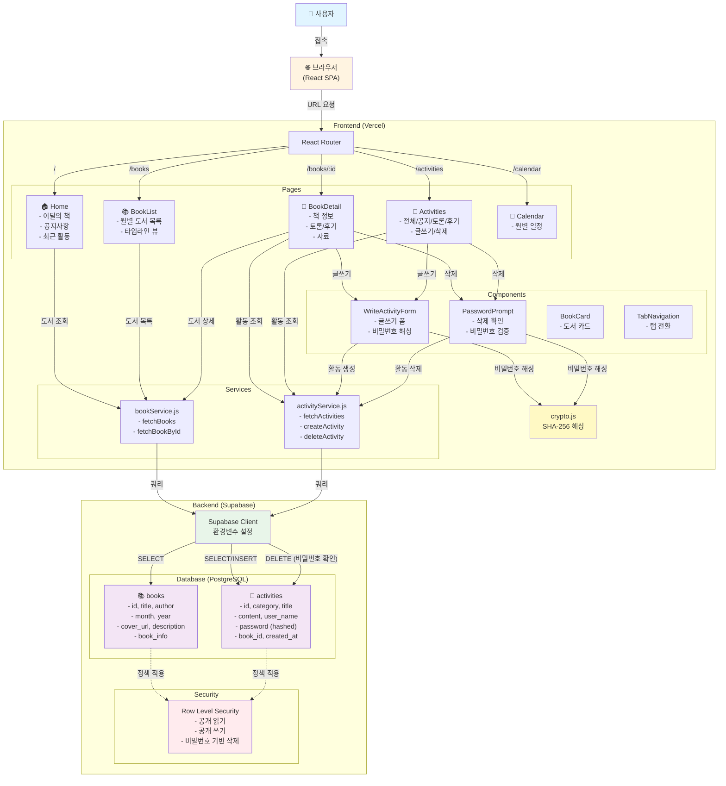

# 아이온 책모임 📚

독서 모임 "아이온 책모임"을 위한 모바일 우선 웹 애플리케이션

## 🚀 프로젝트 개요

- **유형**: Single Page Application (SPA)
- **프레임워크**: React 19 + Vite
- **데이터베이스**: Supabase (PostgreSQL)
- **배포**: Vercel
- **목적**: 독서 일정, 도서 목록, 커뮤니티 활동 관리

## 🛠 기술 스택

| 구분 | 기술 | 버전 |
|------|------|------|
| **Core** | React | ^19.2.0 |
| **Bundler** | Vite | ^7.2.4 |
| **Routing** | React Router | ^7.11.0 |
| **Database** | Supabase | Latest |
| **Styling** | CSS Modules | - |
| **Icons** | Lucide React | ^0.562.0 |
| **Date Utils** | date-fns | ^4.1.0 |

## 📁 프로젝트 구조

```
src/
├── components/
│   ├── common/          # 공통 UI 컴포넌트 (TabNavigation 등)
│   ├── features/        # 기능별 컴포넌트 (BookCard, WriteActivityForm 등)
│   └── layout/          # 레이아웃 컴포넌트 (AppHeader, BottomTabBar)
├── lib/                 # 외부 라이브러리 설정
│   └── supabaseClient.js
├── pages/               # 페이지 컴포넌트
│   ├── Home.jsx
│   ├── BookList.jsx
│   ├── BookDetail.jsx
│   ├── Activities.jsx
│   └── Calendar.jsx
├── services/            # API 서비스 레이어
│   ├── bookService.js
│   └── activityService.js
├── utils/               # 유틸리티 함수
│   └── crypto.js
└── styles/              # 전역 스타일
```

## 🏗 시스템 아키텍처



## ✨ 주요 기능

### 1. 홈 대시보드
- **이달의 책**: 현재 월의 선정 도서 표시 (연도 포함)
- **공지사항**: 최신 공지 3개 표시 (내용 포함)
- **최근 활동**: 커뮤니티 활동 피드 (카테고리 배지 포함)

### 2. 독서 일정 (Books)
- 2026년 월별 도서 목록 타임라인
- 도서 상세 정보 (표지, 제목, 저자, 설명, 소개)
- 정렬: 월 오름차순 → 등록일시 오름차순

### 3. 도서 상세 페이지
- **정보 탭**: 책 소개 (줄바꿈 지원)
- **토론 탭**: 토론 주제 목록 및 작성
- **후기 탭**: 독서 후기 목록 및 작성
- **자료 탭**: 관련 자료 (예정)

### 4. 활동 페이지
- 전체/공지/토론/후기 탭 필터링
- 활동 내용 기본 펼침 (접기/더보기 토글)
- 공지사항 작성 (관리자 전용: AION, 오리, 유하)
- 활동 삭제 (비밀번호 인증)

### 5. 글쓰기 및 삭제
- **작성**: 제목, 내용, 닉네임, 비밀번호 입력
- **비밀번호 보안**: SHA-256 해싱 후 저장
- **삭제**: 비밀번호 확인 후 삭제 가능
- **권한 제어**: 공지사항은 특정 관리자만 작성 가능

## 🗄 데이터베이스 스키마

### Books 테이블
```sql
- id (text, PK)
- month (int2)
- year (int2)
- title (text)
- author (text)
- cover_url (text)
- description (text)
- book_info (text)
- created_at (timestamptz)
```

### Activities 테이블
```sql
- id (uuid, PK)
- category (text) -- notice, discussion, review
- title (text)
- content (text)
- user_name (text)
- password (text) -- SHA-256 해시
- book_id (text, FK)
- book_title (text)
- created_at (timestamptz)
```

## 🔐 보안 기능

- **비밀번호 해싱**: Web Crypto API (SHA-256)
- **RLS (Row Level Security)**: Supabase 정책 적용
  - Books: 공개 읽기
  - Activities: 공개 읽기/쓰기, 비밀번호 기반 삭제
- **환경 변수**: `.env` 파일로 민감 정보 관리

## 🚀 시작하기

### 1. 환경 설정

```bash
# 의존성 설치
npm install

# 환경 변수 설정
cp .env.example .env
```

`.env` 파일에 다음 내용 추가:
```
VITE_SUPABASE_URL=your_supabase_url
VITE_SUPABASE_ANON_KEY=your_supabase_anon_key
```

### 2. 데이터베이스 설정

Supabase SQL Editor에서 다음 스크립트를 순서대로 실행:

1. `supabase_schema_v2.sql` - Books 테이블 생성 및 초기 데이터
2. `supabase_missing_books.sql` - 추가 도서 데이터
3. `supabase_add_book_info.sql` - book_info 컬럼 추가
4. `supabase_add_password.sql` - password 컬럼 추가
5. `supabase_enable_delete.sql` - 삭제 권한 설정

### 3. 로컬 실행

```bash
npm run dev
```

브라우저에서 `http://localhost:5173` 접속

## 📦 배포 (Vercel)

### 환경 변수 설정
Vercel Dashboard → Settings → Environment Variables에서 설정:
- `VITE_SUPABASE_URL`
- `VITE_SUPABASE_ANON_KEY`

### 배포
```bash
git push origin main
```

Vercel이 자동으로 빌드 및 배포합니다.

## 🎨 디자인 특징

- **모바일 퍼스트**: 하단 탭 네비게이션
- **다크 모드 지원**: CSS 변수 기반 테마
- **반응형 디자인**: 모든 화면 크기 대응
- **일관된 UI**: CSS Modules로 스타일 격리

## 📝 주요 컴포넌트

### UI 컴포넌트
- `BookCard`: 도서 카드 (일반/소형 크기)
- `TabNavigation`: 탭 네비게이션
- `WriteActivityForm`: 활동 작성 폼
- `PasswordPrompt`: 비밀번호 확인 모달

### 서비스 레이어
- `bookService`: 도서 데이터 CRUD
- `activityService`: 활동 데이터 CRUD

### 유틸리티
- `crypto.js`: 비밀번호 해싱 (SHA-256)

## 🔄 데이터 흐름

```
User Input → Component → Service Layer → Supabase → Response → UI Update
```

## 📌 향후 개선 사항

- [ ] 사용자 인증 시스템
- [ ] 댓글 기능
- [ ] 파일 업로드 (자료 탭)
- [ ] 알림 기능
- [ ] 검색 기능
- [ ] 페이지네이션

## 📄 라이선스

Private Project

## 👥 기여자

아이온 책모임 팀
